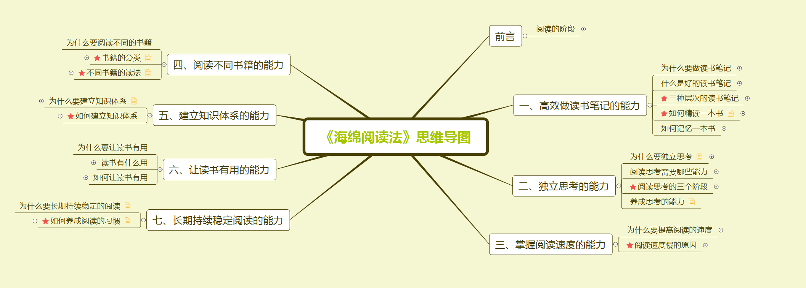

# 《海绵阅读法》

本书针对大多数人在阅读过程中遇到的问题，如读得慢、忘得快、输出吃力、笔记低效、不会独立思考、不知道如何建立知识体系、无法学以致用、难以养成阅读习惯等，讲解了高效阅读需要的七大能力，致力于提供一套系统的阅读方法。

本书共分为七章，包括高效做读书笔记的能力、独立思考的能力、掌握阅读速度的能力、阅读不同书籍的能力、建立知识体系的能力、让读书有用的能力、长期持续稳定阅读的能力，旨在帮助读者最大程度吸收一本书的精华，最大程度从阅读中获益。

本书适合缺乏系统阅读方法，读得慢、忘得快、输出难的学生、职场人，以及有旺盛成长需求、对成长速度不满意、成长遇到瓶颈，想要靠阅读实现自我提升的读者阅读和学习。